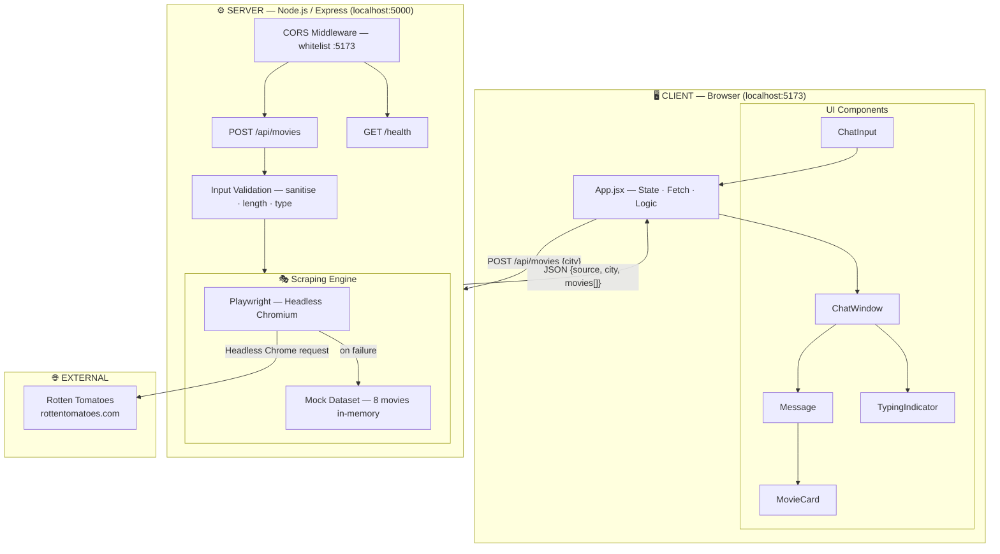
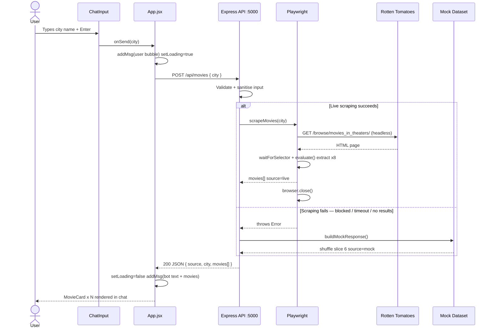
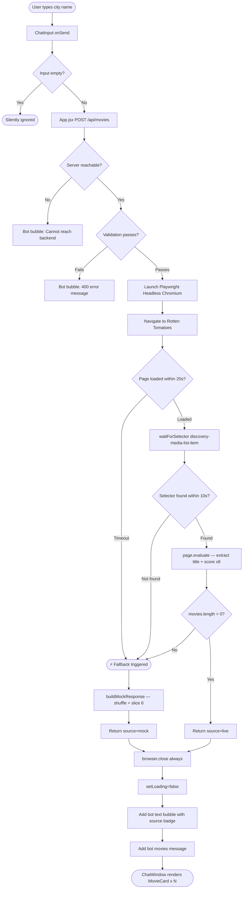
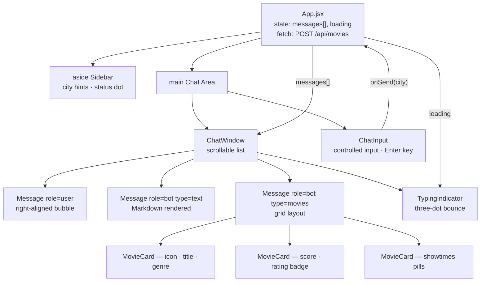
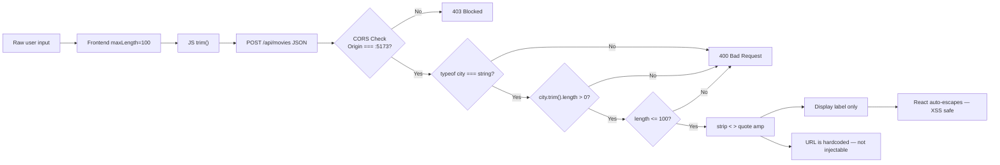

# HLD Diagrams — Movie Finder Chatbot

> **View interactively:** Open `HLD-Diagrams.html` in any browser for the full dark-themed rendered version.  
> GitHub renders the Mermaid blocks below natively.

---

## Diagram 1 — System Architecture Overview

---

## Diagram 2 — Request / Response Sequence

---

## Diagram 3 — Detailed Data Flow

---

## Diagram 4 — React Component Hierarchy

---

## Diagram 5 — Security & Input Sanitization

---

*HLD Diagrams v1.0 — Movie Finder Chatbot — March 2026*
